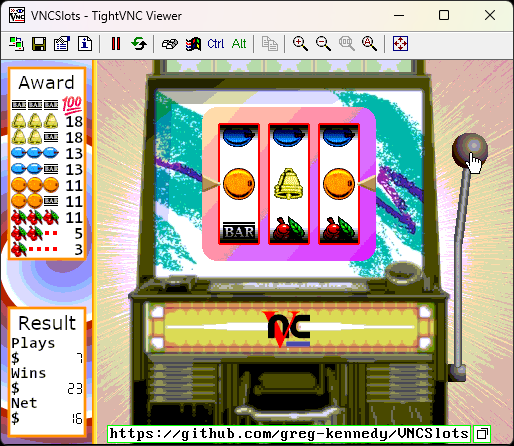

# VNCSlots
Slot machine game played over RFB protocol

## Play now!
Connect your VNC client to `greg-kennedy.com:5900` to play.

## Background
VNC ([Virtual Network Computing](https://en.wikipedia.org/wiki/Virtual_Network_Computing)) is a client-server system intended for screen sharing over TCP/IP networks.  The underlying protocol, RFB ("Remote Frame Buffer"), is very simple: it consists of a short handshake, then contains only a few methods to encode and send (parts of) a single framebuffer to the client, while accepting only mouse and keyboard input from the remote user.  [RFC 6143](https://datatracker.ietf.org/doc/html/rfc6143) describes the protocol: it was last updated in 2011, and it really does show its age.  But more on that later.  Compared to Microsoft's RDP or the Unix X Window System, which send draw commands to the client ("put a window at X, Y named "My Window"), RFB just renders everything on the server and sends a screenshot of it.  Less efficient, useless for accessibility concerns - but a whole lot simpler to understand and implement.

I became interested in understanding the RFB protocol after seeing the [VNC Resolver](https://computernewb.com/vncresolver/) site, which crawls the web for unsecured VNC servers and takes a screenshot of what it finds.  The variety of weird (and scary!) things left open on the web is startling to see - people's desktops or phones, telco hardware, QEMU virtual machines, even industrial control systems.  However, we're used to the idea of VNC as a means to show "a desktop" - even if it's virtual, with VirtualBox or QEMU, you're still seeing "what the screen would show".  It occurred to me that the protocol could do more: there's no reason to make a virtual desktop and take screenshots of it, nor even a need to have a desktop environment at all - since this is just a means to push pixels and take input, you could make a server that serves anything.

So I made a game.

## The Project
This repo contains the code for VNCSlots, a slot machine simulator that plays over VNC.  The various objects (background, handle, coin, etc) are BGR233 format images with some basic blit to assemble the screen.  Since the items stay within fixed boundaries, the client gets the full screen only on initial connect - thereafter, they get the rectangles that have changed since the last update they received.

The slot machine works as a state machine, triggered by clicking the handle or coin slot, or by pressing a key (enter, space, down arrow).  At 25fps the coin drops, handle depresses and springs back, then `/dev/urandom` provides 3 * rand(20) values for the target "stops".  The reels spin at least once, then advance to the correct position, and each subsequent reel must spin longer than the previous.  Finally payouts are determined and the machine goes back to "waiting" state.  Most of the time is spent blocked waiting for client packets, only doing regular animation ticks once the process is kicked off.

I'm no slot machine expert and can't come up with fun reel combinations or payouts, so I have reproduced the Jennings "Chief" series of machine, with single-cherry-pays awards, and using V-12-70 reel strips.  This [slot machine statistics page](http://www.quadibloc.com/math/sloint.htm) calculates a theoretical "house" profit of 16.8125%, and simulation gets roughly this amount as well.  Over time the net winnings should trend more and more negative, just like a real casino :)

Meanwhile, client connections have their own state flow they follow.  Each new connection has a 20 byte buffer for capturing incoming streams: when the necessary number of bytes are in the buffer, nested switch statements do all the updates and handle user input.  I ended up coding a lot of this to the needs of the game so, e.g. the mouse X/Y isn't always captured, and the user clipboard share is simply discarded, and so on.  It should be possible to generalize, but then, perhaps you would use [LibVNCServer](https://github.com/LibVNC/libvncserver) instead to add RFB functionality to your app.  This was after all an experiment in learning the nuts and bolts of RFB.

Each connected client manages their own mouse and keyboard (instead of being shared like a virtual desktop is), but the slot machine is shared for everyone: a client pulling the handle on one connection is visible to all other connections as well.  If any money is won, the client will play the default OS notification sound (bell), an audiovisual treat.

Clicking the "copy" icon next to the URL puts the link into the user's clipboard.

## RFB Protocol
As mentioned above, the RFB protocol is simple and limited in important ways.  A short discussion follows.

### Initialization / Handshake
The first steps, after establishing TCP connection, are a handshake and negotiation of some details.  The client and server exchange an ASCII string with the RFB protocol version (currently, 3.008), then work out a security method to use.  The RFC specifies two types of authorization:
* None (lol), and
* VNC Authentication.

VNC Auth is at least better than nothing, but it's still pretty terrible.  The server sends 16 random "challenge" bytes to the client, the client encrypts the challenge with DES using the user-supplied password as the key, and sends it to the server.  If the response doesn't match the server's own encyption (using its stored password key), then the server sends a Wrong Password message and closes the connection.  DES itself is a long-outdated cryptography standard that is deprecated everywhere.  Moreover, the password-as-key limits you to 8 characters (it will truncate longer passwords...!) which is absolutely not enough for strong password.  Finally, passing the challenge just lets the session continue.  **There is no TLS or similar end-to-end encoding for RFB**, meaning any eavesdropper can watch your session, or inject their own mouse / keystrokes or keep the session open.  If you want secure RFB, you tunnel it over SSH, or you put it on a LAN and don't tell the world.

After this comes some exchange of pixel formats.  The server tells the client what its "native" pixel format is, and the client tells the server what pixel format it wants, and then the server must do all conversions to the preferred format.  Initially I'd hoped the BGR233 format would save me some bandwidth, but it doesn't (usually): there are provisions for paletted modes, which TightVNC doesn't support, and there is an option for 256-color-mode, which TightVNC doesn't set by default.  So the server largely ends up serving 32 bits per pixel, of which 8 are always 0 (alpha?), and the rest are overkill for the native format of the server.

This highlights an aspect of the design, which is that the thin clients were severely underpowered, and so the server does a lot of work to cater to whatever formats and encodings the client wants - sometimes to a rather wasteful degree.

### Request Frame Buffer
When the client is ready for a new frame, it sends a "Request Frame Buffer" message to the server, indicating the area it cares about and also whether it needs the screen NOW (because it's forgotten or needs to repaint) or it wishes to wait for some activity before getting the update.  The server sends a stream of updated rectangles back, when some change has occurred.  The goal of this setup was flow control: to ensure the server did not overwhelm the client with updates, it only answers when the client calls for another.  Unfortunately this also means the peak framerate is dictated by the long round trip latency of the ping/pong for these asks.  There is no provision in the spec for putting multiple updates on the wire while waiting to hear back from the client.

### Encodings
A key part of RFB is "encodings", the means by which the server compresses the framebuffer updates and sends them to the client.  The spec defines only a handful: "Raw" (no encoding, just the pixels directly), "CopyRect" (copy this region from another already painted), "RRE" (a background color and a series of colored rectangles that paint the region completely), "HexTile" (break the scene into 16x16 tiles and encode each one as before), plus "TRLE" (like HexTile but also supports palettes and 24bpp pixels), and "ZRLE" (TRLE but with Zlib).  That's all there is.  Again, the spec is showing its age: all these are generally poor schemes that decode very fast on a Pentium 200mhz, but there's no provision for e.g. PNG, JPEG or x264 updates as you might have with a modern design.

There are also "pseudo"-encodings which provide a means to extend the protocol a bit.  Two are defined in the spec: one to indicate that the client can cope with desktop resizes, and the other to send a cursor image that is rendered client-side, so that the server doesn't have to send a bunch of draw commands in response to every mouse movement.

At connection start, the client tells the server all the encodings it can handle (in a prioritized list), and the server then ignores the ones it doesn't know about when choosing how to send messages back.  In this way extensions can be added that don't require a new protocol version or spec update.

### Other Messages
The last few message types provide the minimum to make the remote interface work: send mouse (one mouse, up to 8 buttons) and keyboard (using X Keymap symbols ugh), and a limited provision for synchronizing clipboard contents.  Latin-1 text only, no other encoding (and UTF-8?  are you kidding?).  No client-side hardware, whether that's a game controller or a mass storage device.

### Sound
There is no means to play sound, with the single exception that the server can tell the client to play a Bell (notification).

### Proprietary Extensions
Given the issues noted above, several vendors have added their own extensions to get around the limitations: there's a mode for sending JPEG regions and one that lets you request continuous updates, QEMU has a streaming audio extension, there's a number of authentication and encryption systems in use.  TightVNC's "tight" encoding is a real purpose-built codec for RFB that includes things like drawing gradients on the tiles to shave a few extra bytes.  But, it seems IETF is in no hurry to update the spec and standardize any of these.  Which is a shame, I think: I'm a big fan of these domain-specific protocols, but the Internet seems increasingly trending to Just Stuff It In HTTP (or WebSockets) so maybe this is frozen forever.

## Closing Thoughts
Working on this was interesting and I hope that people stumble across it in the future and decide to pull the handle a few times.  I'm still somewhat interested in the idea of RFB beyond the shared desktop: for example, there's no reason every connected client must see the same view either.  A card game, maybe, where each user gets a custom vision of their own cards?  A single server providing an entire dedicated VM to each new connection?  Multiple mouse pointers visible on one shared screen, running around and activating different elements - say, a Pong game?  The possibilites are out there...
